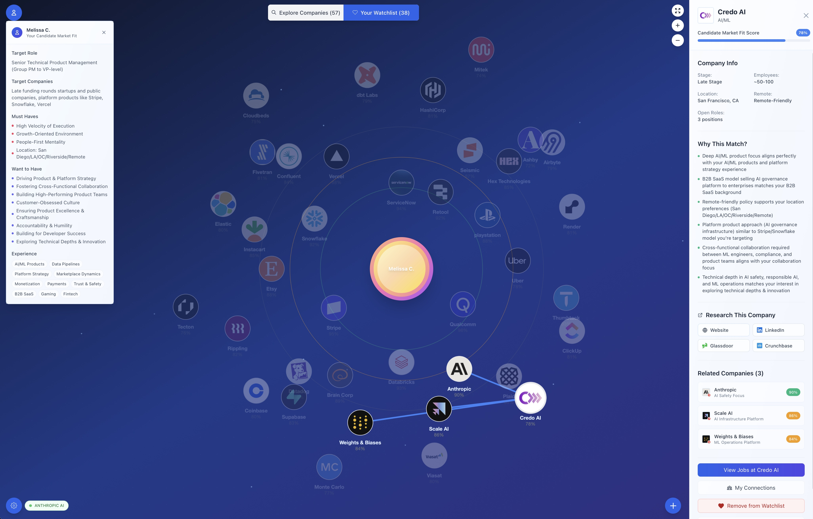

# Cosmos

A visual career exploration tool that helps you discover companies aligned with your skills, goals, and preferences. See your perfect matches at a glance with an interactive graph showing how companies relate to your Candidate Market Fit (CMF) profile.

> **Want to try it?** [Join the waitlist](https://cosmos-find.me/) for early access.



## ✨ Features

- 🎯 **CMF-Centered Visualization** - Your profile at the center with companies positioned by match score
- 🔍 **Interactive Company Research** - Click any company to explore detailed information
  - Match reasons, industry, stage, team size, open roles
  - Quick links to LinkedIn, Glassdoor, Crunchbase
  - Find your connections at the company
- 🤖 **AI-Powered Analysis** - Add companies and get intelligent CMF matching (optional)
- 💾 **Smart Persistence** - Watchlist, preferences, and removed companies saved automatically
- 🌐 **Connection Mapping** - Visual relationship network between companies
- 📱 **Responsive Design** - Works beautifully on desktop, tablet, and mobile

## 🚀 Quick Start

See the **[Complete Setup Guide](docs/01-GETTING_STARTED.md)** for installation, environment configuration, and development modes.

## 🏗️ Tech Stack

- **Framework:** Next.js 15 with TypeScript
- **Visualization:** Cytoscape.js for interactive graphs
- **Styling:** Tailwind CSS
- **AI (Optional):** Anthropic Claude for company analysis
- **Testing:** Vitest + Playwright (324 tests with performance regression detection)
- **Database (Optional):** Supabase for multi-user persistence

## 📚 Documentation

### Getting Started
- **[Complete Setup Guide](docs/01-GETTING_STARTED.md)** - Detailed installation and configuration
- **[Project Structure](docs/guides/PROJECT_STRUCTURE.md)** - Code organization and architecture
- **[Testing Guide](docs/guides/TESTING.md)** - Unit, performance, and E2E tests

### User Guides
- **[Customization Guide](docs/05-CUSTOMIZATION.md)** - Customize CMF profile and companies
- **[Data Structures](docs/04-DATA_STRUCTURES.md)** - TypeScript interfaces and data models
- **[Troubleshooting](docs/08-TROUBLESHOOTING.md)** - Common issues and solutions

### Architecture
- **[Persistence Architecture](docs/architecture/PERSISTENCE_ARCHITECTURE.md)** - Database and storage strategies
- **[LLM Integration](docs/guides/LLM_INTEGRATION.md)** - AI features and setup

### Development
- **[Development Guide](docs/03-DEVELOPMENT.md)** - TDD workflow and development servers
- **[Contributing Guide](docs/09-CONTRIBUTING.md)** - How to contribute to the project

## 🧪 Testing

```bash
# Run all tests
npm test

# Performance regression tests (infinite loop detection, API monitoring)
npm run test:performance

# E2E visual regression tests
npm run test:e2e
```

**324 tests** covering unit, integration, performance, and visual regression. See [Testing Guide](docs/guides/TESTING.md) for details.

## 📋 Task Management

All tasks are tracked in [GitHub Issues](https://github.com/pagalmes/company-fit-explorer/issues).

See [CONTRIBUTORS.md](.github/CONTRIBUTORS.md) for team member GitHub handles.

## 🤝 Contributing

We follow Test-Driven Development. Before contributing:

1. Run existing tests: `npm test`
2. Write tests for new features first
3. Implement features to make tests pass
4. Ensure coverage stays above 85%

See [Contributing Guide](docs/09-CONTRIBUTING.md) for detailed guidelines.

## 📄 License

MIT License - see [LICENSE](LICENSE) file for details.

**Author:** Pierre-Andre Galmes

## 🙏 Acknowledgments

- [Cytoscape.js](https://cytoscape.org/) - Graph visualization
- [Logo.dev](https://logo.dev) - Company logos
- [Anthropic](https://anthropic.com) - AI analysis

---

**Questions?** Open an issue or check our [documentation](docs/).
