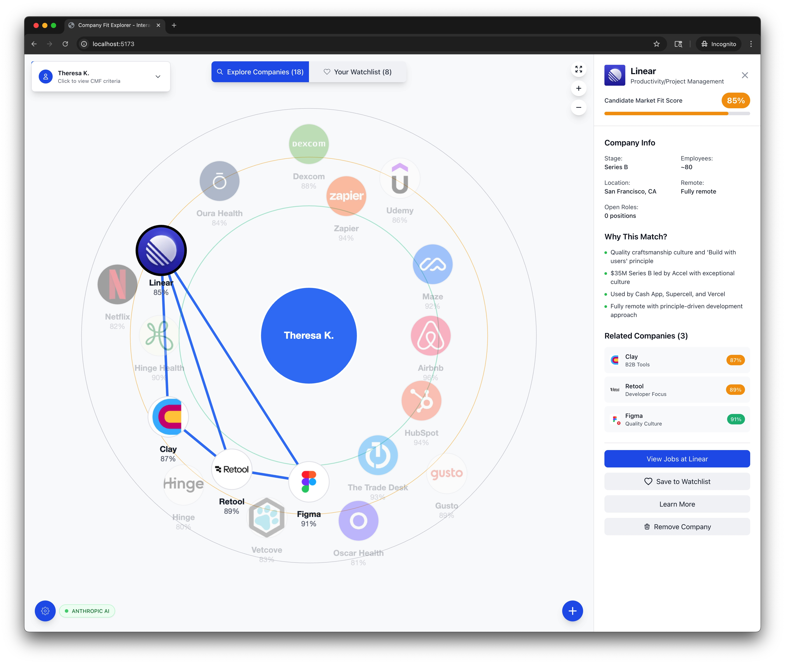

# Company Fit Explorer - Production Multi-User CMF Platform

[](./docs/guides/TESTING.md)
[](./docs/guides/TESTING.md#coverage-reports) 
[](./docs/architecture/PERSISTENCE_ARCHITECTURE.md)
[](./docs/security/SECURITY.md)
[](./.github/workflows/ci.yml)

A production-ready, multi-user CMF (Candidate Market Fit) platform that helps job seekers discover personalized companies based on their career goals, skills, and preferences. Features complete user management, admin dashboard, and personalized data persistence.

## 🏗️ **Production Architecture**

- **Frontend**: Next.js 15 with App Router
- **Backend**: Supabase (Authentication + Database)  
- **Persistence**: [Hybrid Strategy](./docs/architecture/PERSISTENCE_ARCHITECTURE.md) (Database + File fallbacks)
- **Deployment**: Vercel-ready with environment configuration



## ✨ Features

- **🌟 Dreamy First Contact**: Magical onboarding experience for first-time users with cosmic animations and file upload
- **CMF-Centered Graph**: Your Candidate Market Fit profile sits at the center with companies positioned around it based on match scores
- **Collapsible CMF Panel**: Space-saving CMF information panel in the top-left corner:
  - **Click to Collapse/Expand**: Toggle between full details and compact header
  - **Keyboard Accessible**: Full keyboard navigation support (Enter, Space, Escape)
  - **Persistent State**: Remembers your collapse preference across browser sessions
  - **Smooth Animations**: Polished expand/collapse transitions for better UX
  - **Responsive Design**: Optimized for desktop, tablet, and mobile devices
- **Precise Company Positioning**: Companies arranged in perfect circles around your CMF using exact angle/distance calculations
- **Match Quality Zones**: Visual background zones indicate excellent (90%+), good (80%+), and fair matches
- **Interactive Company Details**: Click any company to see comprehensive information:
  - Match score percentage and detailed match reasons
  - Industry, stage, location, and team size
  - Open roles and remote work policies
  - Connection types to other companies in your network
- **Company Management**: Full control over your company exploration:
  - **Remove Companies**: Clean "Remove Company" button in company details
  - **Smart Restore**: Automatically restores previously removed companies when re-added
  - **Persistent Removal**: Removed companies stay hidden across browser sessions
  - **Watchlist Integration**: Automatically removes companies from watchlist when removed
- **Connection Highlighting**: Hover over companies to see their relationships:
  - 🔵 **AI Competitors** - Companies in similar AI/ML spaces
  - 🟢 **Similar Culture** - Companies with similar values and culture
  - 🟡 **Platform Focus** - Companies with platform/API strategies
  - 🟣 **Research Focus** - Research-oriented organizations
- **Smart Visual Design**: 
  - Company nodes sized and colored by match quality
  - 2-letter abbreviations inside company circles
  - Company names and match percentages displayed below nodes
  - Smooth hover effects and connection highlighting
- **Watchlist Feature**: Save companies you're interested in and track them:
  - **Save Companies**: Click "Save to Watchlist" button with heart icon
  - **View Mode Toggle**: Switch between "Explore Companies" (15) and "Watchlist" (X) views
  - **Heart Indicators**: Subtle heart badges on company logos in the sidebar
  - **Persistent Storage**: Watchlist data saved locally across browser sessions
  - **Statistics Dashboard**: Track total companies, 90%+ matches, and open roles
  - **Empty States**: Elegant prompts when watchlist is empty
  - **Cross-tab Sync**: Real-time updates when watchlist changes in other tabs

## 🚀 Quick Start

### Prerequisites

- Node.js (v16 or higher)
- npm or yarn

### Installation

1. Clone the repository:
```bash
git clone <your-repository-url>
cd company-fit-explorer
```

2. Install dependencies:
```bash
npm install
```

3. **Set up Supabase Database (Optional but Recommended)**

For full functionality with user data persistence:

```bash
# Copy environment template
cp .env.example .env.local

# Edit .env.local with your Supabase credentials
# Get these from your Supabase project dashboard → Settings → API
```

Then run the automated setup:
```bash
npm run setup:supabase
```

**📖 Detailed Setup Guide**: See [docs/SUPABASE_SETUP.md](docs/SUPABASE_SETUP.md) for complete instructions.

**⚡ Skip Database Setup**: The app works perfectly without Supabase - it will use default company data and localStorage for persistence.

4. Start the development server:

**Option A: Full Development Experience (Recommended)**
```bash
npm run dev:full
```
This runs all three servers with color-coded output:
- 🔵 **Next.js app** (port 3000) - Main application interface
- 🟢 **File server** (port 3001) - Automatic companies.ts persistence  
- 🟡 **LLM server** (port 3002) - AI functionality and company analysis

**Option B: Next.js App Only**
```bash
npm run dev
```
Basic development without automatic file persistence.

### 🌟 First-Time Experience

For new users, the app shows a magical "Dreamy First Contact" onboarding flow:
1. **Cosmic Welcome**: Animated spark with floating stars
2. **Universe Awakening**: Explosion transition animation  
3. **File Upload**: Upload resume and career fit document
4. **Profile Processing**: Files are processed to customize your CMF profile
5. **Universe Generation**: Cosmic loading screen before launching into the main app

**Test URLs:**
- First-time experience: `http://localhost:3000/` 
- Skip intro (for testing): `http://localhost:3000/?skip-intro=true`
- Reset experience: Clear localStorage and revisit

**File Processing:**
- Uploaded files are analyzed to extract skills, experience, preferences
- Creates personalized CMF profile based on your documents
- Fallback to default profile if processing fails

**Option C: Individual Servers**
```bash
# Individual server commands
npm run dev              # React app only
npm run dev:file-server  # File server only  
npm run dev:llm-server   # LLM API server only

# Manual multi-terminal setup
# Terminal 1: React app
npm run dev
# Terminal 2: File server
npm run dev:file-server  
# Terminal 3: LLM server
npm run dev:llm-server
```

4. Open your browser and navigate to `http://localhost:3000` (or the port shown in the console)

### 💾 Development Persistence

When using `npm run dev:full` or running servers manually:
- **Added companies** are automatically saved to `companies.ts`
- **Watchlist changes** persist across browser refreshes
- **Removed companies** are tracked and can be restored
- **View mode preferences** are maintained
- **LLM functionality** is available for company analysis and testing

Without the LLM server, AI features like "Test Backend Connection" and company analysis won't work.
Without the file server, changes are only saved to localStorage and won't persist across file edits.

## 🧪 Test-Driven Development

This project uses comprehensive **multi-layer testing** with **224 unit tests + 14 performance tests + 6 E2E visual tests** covering all core functionality including **infinite loop detection**, **performance regression protection**, and **critical interaction monitoring**, ensuring reliability and preventing regressions across all system layers.

### Quick Test Commands
```bash
# Unit Tests
npm test              # Watch mode for development
npm run test:run      # CI mode (run once)  
npm run test:coverage # Generate coverage report
npm run test:ui       # Visual test runner interface

# Performance & Regression Tests
npm run test:performance  # Run performance regression tests (14 tests)
npm run test:critical     # Run critical interaction E2E tests
npm run test:regression   # Run both performance + critical tests

# E2E Visual Tests  
npm run test:e2e      # Screenshot-based visual regression tests
npm run test:e2e:ui   # Interactive E2E test runner  
npx playwright show-report tests/reports # View test results and screenshots
```

### TDD Workflow
1. **Write failing test** → 2. **Implement feature** → 3. **Verify test passes** → 4. **Refactor safely**

**Test Coverage:**
- ✅ **244 total tests** across 21 test files (224 unit + 14 performance + 6 e2e)
- ✅ **Utility functions** (58 tests) - Data transformations, formatting, validations, storage utilities
- ✅ **Component logic** (69 tests) - UI interactions, rendering, accessibility  
- ✅ **Integration testing** (15 tests) - End-to-end workflows with real data
- ✅ **State management** (19 tests) - ExplorationStateManager with watchlist functionality
- ✅ **Type safety** (10 tests) - Interface validation, data integrity
- ✅ **Development tools** (16 tests) - File writing, dev server integration
- ✅ **Performance regression** (14 tests) - Infinite loop detection, API monitoring, rendering performance
  - 🔍 **Infinite Loop Detection** (4 tests) - useEffect dependency array issues
  - 📡 **API Call Monitoring** (5 tests) - Prevents infinite API requests
  - 🚀 **Performance Metrics** (5 tests) - Render timing, memory leak detection
- ✅ **Visual regression** (6 tests) - E2E screenshot testing across browsers
- ✅ **Graph interactions** (12 tests) - Cytoscape integration, zoom controls, positioning

### 🚀 Performance Testing Framework

Our comprehensive performance testing suite prevents critical production issues:

**🔍 Infinite Loop Detection**: Catches React useEffect dependency array issues that cause:
- Unstable object/array dependencies triggering excessive re-renders
- Missing dependency arrays causing continuous effect execution
- Function recreation patterns leading to infinite loops

**📡 API Call Monitoring**: Prevents infinite API request loops by:
- Monitoring fetch call frequency and patterns
- Testing authentication failure handling without retry storms  
- Validating reasonable API call limits (max 3 calls per test)

**🚀 Performance Regression**: Detects performance degradation through:
- Component render timing measurements (< 16ms for 60fps)
- Memory leak detection in useEffect cleanup functions
- Dependency array performance issue identification

**⚡ Critical Interaction Tests**: E2E validation of user-critical flows:
- Node selection stability without flickering
- Real browser network request monitoring  
- Performance validation under actual user load

**🛡️ Production Issue Prevention**: This framework was built after encountering critical production bugs where:
1. Node selection was flickering due to unstable `companies` array in useEffect dependencies
2. Infinite API calls to `/api/user/data` were caused by unstable `markAsVisited` function references

All tests run in CI/CD to catch these issues before deployment.

📖 **Complete testing guide:** [TESTING.md](./docs/guides/TESTING.md)

## 🛠️ Available Scripts

### Development
- `npm run dev:full` - **🚀 Start all servers** (React + File + LLM with colors)
- `npm run dev` - Start React development server only
- `npm run dev:file-server` - Start file server for companies.ts updates
- `npm run dev:llm-server` - Start LLM API server for AI features
- `npm run build` - Build for production
- `npm run preview` - Preview production build
- `npm start` - Alias for `npm run dev`

### Testing
- `npm test` - Run tests in watch mode
- `npm run test:run` - Run all tests once
- `npm run test:coverage` - Generate coverage report
- `npm run test:ui` - Open visual test interface
- `npm run test:performance` - **🚀 Run performance regression tests** (infinite loops, API monitoring)
- `npm run test:critical` - Run critical interaction E2E tests
- `npm run test:regression` - **⚡ Run complete regression suite** (performance + critical)
- `npm run test:e2e` - Run E2E visual regression tests
- `npm run test:e2e:ui` - Interactive E2E test runner

## 🏗️ Built With

- **React 18.2** - Frontend framework
- **TypeScript 5.2** - Type safety and development tooling
- **Next.js 15** - Full-stack React framework with App Router
- **Tailwind CSS 3.3** - Utility-first CSS framework
- **Cytoscape.js 3.26** - Graph visualization library
- **Vitest 3.2** - Unit testing framework
- **Playwright 1.54** - E2E testing and visual regression
- **Testing Library** - React component testing utilities

## 📁 Project Structure

```
src/
├── components/           # React components
│   ├── CMFGraphExplorerNew.tsx      # Main CMF graph explorer component with persistent state
│   ├── CompanyGraph.tsx             # Cytoscape graph visualization
│   ├── CompanyDetailPanel.tsx       # Company details sidebar
│   ├── CollapsibleCMFPanel.tsx      # Collapsible CMF information panel
│   ├── RemoveCompanyModal.tsx       # Company removal confirmation modal
│   ├── AddCompanyModal.tsx          # Add/restore company modal with LLM analysis
│   ├── LLMSettingsModal.tsx         # AI settings configuration modal
│   ├── __tests__/                   # Component tests
│   └── index.ts                     # Component exports
├── data/                # Static data and configuration
│   └── companies.ts                 # Complete user exploration state with persistent data
├── services/            # Business logic and state management
│   ├── ExplorationStateManager.ts  # Centralized state management for exploration data
│   └── __tests__/                   # Service tests
├── hooks/               # Custom React hooks (legacy)
│   ├── useCompanySelection.ts       # Company selection state hook
│   ├── useWatchlist.ts              # Watchlist state management hook
│   └── index.ts                     # Hook exports
├── styles/              # Styling and CSS
│   └── index.css                    # Global styles and Tailwind imports
├── types/               # TypeScript type definitions
│   ├── index.ts                     # CMF, Company, and UserExplorationState definitions
│   ├── watchlist.ts                 # Watchlist interfaces and types
│   └── __tests__/                   # Type validation tests
├── utils/               # Utility functions and configurations
│   ├── devFileWriter.ts             # Development-only file writing for persistence
│   ├── graphDataTransform.ts        # Graph positioning and styling logic
│   ├── removedCompaniesStorage.ts   # Removed companies persistence utilities
│   ├── panelStorage.ts              # CMF panel state persistence utilities
│   ├── companyStateManager.ts       # Cross-tab company synchronization
│   ├── llm/                         # AI integration utilities
│   ├── index.ts                     # Helper functions
│   └── __tests__/                   # Utility function tests
├── App.tsx              # Root application component
└── main.tsx             # Application entry point
```

## 📊 Data Structure

The application uses a comprehensive persistent state system for exploration data:

```typescript
interface UserExplorationState {
  id: string;                          // User identifier
  name: string;                        // User display name
  cmf: UserCMF;                        // Complete CMF profile
  baseCompanies: Company[];            // Original dataset companies
  addedCompanies: Company[];           // User-added companies with LLM analysis
  removedCompanyIds: number[];         // IDs of companies removed by user
  watchlistCompanyIds: number[];       // IDs of companies saved to watchlist
  lastSelectedCompanyId?: number;      // Last selected company for restoration
  viewMode: ViewMode;                  // Current view: 'explore' or 'watchlist'
}

interface UserCMF {
  id: string;
  name: string;
  mustHaves: string[];        // Critical requirements
  wantToHave: string[];       // Nice-to-have preferences  
  experience: string[];       // Relevant experience areas
  targetRole: string;         // Desired position level
  targetCompanies: string;    // Company stage preference
}

interface Company {
  id: number;
  name: string;
  logo: string;               // Company logo URL
  careerUrl: string;          // Careers page URL for applications
  matchScore: number;         // CMF match percentage (0-100)
  industry: string;           // Company industry
  stage: string;              // Funding/company stage
  location: string;           // Primary location
  employees: string;          // Team size range
  remote: string;             // Remote work policy
  openRoles: number;          // Available positions
  connections: number[];      // Connected company IDs
  connectionTypes: Record<number, string>; // Relationship types
  matchReasons: string[];     // Why this company matches your CMF
  color: string;              // Node color based on match quality
  angle?: number;             // Position angle around CMF center
  distance?: number;          // Distance from center based on match score
}
```

## 🎨 Customization

### Updating Your CMF Profile

Edit the user profile in `src/data/companies.ts`. The system now uses complete `UserExplorationState` objects:

```typescript
const yourProfile: UserExplorationState = {
  id: "your-id",
  name: "Your Name",
  cmf: {
    id: "your-id",
    name: "Your Name", 
    mustHaves: [
      "Your critical requirements",
      "Non-negotiable needs"
    ],
    wantToHave: [
      "Nice-to-have preferences",
      "Additional interests"
    ],
    experience: ["Your experience areas"],
    targetRole: "Your desired role level",
    targetCompanies: "Your company stage preference"
  },
  baseCompanies: baseCompanies,    // Reference to main dataset
  addedCompanies: [],              // Your custom companies
  removedCompanyIds: [],           // Companies you've removed
  watchlistCompanyIds: [],         // Your saved companies
  lastSelectedCompanyId: undefined,
  viewMode: 'explore'
};

// Switch active user by changing this line:
export const activeUserProfile = yourProfile;
```

### Adding New Companies

**Option 1: Use the UI (Recommended)**
- Click the "+" button in the application
- Enter company name and let the LLM analyze it against your CMF
- Companies are automatically added to your `addedCompanies` array
- In development mode, changes are saved to `companies.ts` automatically

**Option 2: Manual Addition**
Add companies to the `baseCompanies` array in `src/data/companies.ts`:

```typescript
{
  id: 20, // Use next available ID
  name: "New Company",
  logo: "https://logo.clearbit.com/company.com",
  careerUrl: "https://company.com/careers",
  matchScore: 85,
  industry: "Industry",
  stage: "Company Stage", 
  location: "Location",
  employees: "Team Size",
  remote: "Remote Policy",
  openRoles: 5,
  connections: [1, 3], // IDs of connected companies
  connectionTypes: { 1: "Competitor", 3: "Partner" },
  matchReasons: ["Reason why it matches your CMF"],
  color: "#F59E0B", // Color based on match score (auto-calculated)
  angle: 45,        // Position angle around center (auto-calculated)
  distance: 100     // Distance from center (auto-calculated)
}
```

### Customizing Match Score Calculation

Match scores can be enhanced to be dynamic based on:
- Alignment with your must-have requirements
- Geographic location preferences  
- Company culture and values fit
- Role level and compensation expectations
- Industry and technical focus areas

### Using the Watchlist Feature

**Save Companies to Your Watchlist:**
- Click any company node to view details in the sidebar
- Click "Save to Watchlist" button with the heart icon
- The button color changes to red when a company is saved

**Switch Between Views:**
- Use the toggle buttons at the top: "Explore Companies (15)" or "Watchlist (X)"
- Explore mode shows all companies in the dataset
- Watchlist mode filters to show only your saved companies

**Track Your Progress:**
- View watchlist statistics in the sidebar (total companies, excellent matches, open roles)
- Heart indicators appear on company logos in the sidebar for saved companies
- Data persists across browser sessions using localStorage

### Company Management

**Remove Companies:**
- Click any company to view details in the sidebar
- Click the "Remove Company" button at the bottom
- Confirm removal in the modal dialog
- Removed companies are hidden from both explore and watchlist views

**Restore Companies:**
- Use the "+" button to add a company
- If you try to add a previously removed company, it will be automatically restored
- No LLM analysis is needed for restored companies (improves performance)

**Persistent Storage:**
- All removal/restore actions are saved across browser sessions
- Removed companies remain hidden until explicitly restored
- Data is synchronized across multiple browser tabs

### CMF Panel Customization

**Collapse/Expand the CMF Panel:**
- Click anywhere on the CMF panel header to toggle
- Use keyboard shortcuts: Enter, Space (expand/collapse), Escape (collapse only)
- Your preference is automatically saved for future visits
- Provides more screen space for graph visualization when collapsed

### Styling Customization

The application uses Tailwind CSS. Key styling areas:
- `src/styles/index.css` - Global styles and Tailwind imports
- Component classes in the TSX files for layout and colors
- Cytoscape styles in `src/utils/graphDataTransform.ts` for graph visualization

## 🔄 Company Connections

- **AI Competitor**: Companies in similar AI/ML technology spaces
- **Similar Culture**: Organizations with comparable values and work culture
- **Platform Focus**: Companies with platform, API, or infrastructure strategies  
- **Research Focus**: Research-oriented organizations and labs
- **Developer Tools**: Companies building tools and platforms for developers
- **Fintech APIs**: Financial technology and payment processing companies

## ⌨️ Keyboard Shortcuts

The application supports keyboard navigation for accessibility:

### CMF Panel Navigation
- **Enter** or **Space**: Toggle collapse/expand of CMF panel
- **Escape**: Collapse CMF panel (when expanded)
- **Tab**: Navigate between interactive elements

### General Navigation
- **Tab**: Move focus between UI elements
- **Shift + Tab**: Move focus backwards
- **Enter**: Activate buttons and links
- **Escape**: Close modals and dialogs

## 📱 Responsive Design

The application is responsive and works on:
- Desktop computers
- Tablets
- Mobile devices (with optimized touch interactions)

## 📚 Documentation

Complete documentation is organized in the `docs/` directory:

### Architecture
- [**Persistence Architecture**](./docs/architecture/PERSISTENCE_ARCHITECTURE.md) - Database and file system strategies
- [**User Profile Architecture**](./docs/architecture/USER_PROFILE_ARCHITECTURE.md) - CMF profile management
- [**Agentic Implementation Guide**](./docs/architecture/AGENTIC_IMPLEMENTATION_GUIDE.md) - LLM integration patterns

### Guides  
- [**Testing Guide**](./docs/guides/TESTING.md) - Complete testing strategy and commands
- [**LLM Setup**](./docs/guides/SETUP_LLM.md) - AI provider configuration
- [**LLM Integration**](./docs/guides/LLM_INTEGRATION.md) - Advanced AI features
- [**Vitest Workarounds**](./docs/guides/VITEST_BUG_WORKAROUND.md) - Testing troubleshooting

### Security
- [**Security Documentation**](./docs/security/SECURITY.md) - RLS policies and authentication hardening

### Product
- [**Product Overview**](./docs/PRODUCT_OVERVIEW.md) - Feature specifications and user flows

## 🤝 Contributing

We use **Test-Driven Development** to ensure code quality. Please follow these guidelines:

### Before Making Changes
1. **Run existing tests**: `npm test`
2. **Ensure all tests pass** (currently 212 tests across 13 files)
3. **Check coverage doesn't decrease**: `npm run test:coverage`
4. **Run E2E tests**: `npm run test:e2e` (may need visual baseline updates)

### Adding New Features (TDD Approach)
1. **Write test first** describing the expected behavior
2. **Run test** to confirm it fails (red phase)
3. **Implement feature** to make test pass (green phase)
4. **Refactor code** while keeping tests green
5. **Ensure coverage stays above 85%**

### Pull Request Process
1. Fork the repository
2. Create a feature branch: `git checkout -b feature/amazing-feature`
3. **Write tests for new functionality**
4. Implement features following TDD workflow
5. **Verify all tests pass**: `npm run test:run`
6. Commit your changes: `git commit -m 'Add amazing feature'`
7. Push to the branch: `git push origin feature/amazing-feature`
8. Open a Pull Request

### Test Categories to Consider
- **Unit Tests**: Individual functions and utilities
- **Component Tests**: UI interactions and rendering  
- **Integration Tests**: End-to-end user workflows
- **Data Validation**: Real dataset integrity checks

## 🔧 Troubleshooting

### Automatic Persistence Not Working

If added companies, watchlist changes, or removals aren't being saved to `companies.ts`:

**Problem**: Development file server isn't running
**Solution**: 
```bash
# Option 1: Use the full development setup
npm run dev:full

# Option 2: Start the file server manually (if React app is already running)
npm run dev:file-server
```

**Verify it's working**:
- Check console for "💾 Automatically saved to companies.ts" messages
- File server should show: "🚀 Development file server running on http://localhost:3001"
- After starting the file server, refresh your browser tab

**Alternative**: If file server isn't working, check the browser console for manual copy/paste instructions

### Performance Issues

**Slow hover/selection**: Check if too many companies are loaded
**Graph rendering issues**: Try refreshing the page or clearing localStorage
**LLM analysis slow**: Company analysis depends on external API response times

### E2E Test Failures

Visual regression tests may fail after UI changes:
```bash
# Update test snapshots after visual improvements
npm run test:e2e -- --update-snapshots
```

## 📝 License

This project is licensed under the MIT License - see the [LICENSE](LICENSE) file for details.

**Author:** Pierre-Andre Galmes

## 🙏 Acknowledgments

- [Cytoscape.js](https://cytoscape.org/) for the excellent graph visualization library
- [Clearbit](https://clearbit.com/) for company logos
- [Tailwind CSS](https://tailwindcss.com/) for the utility-first CSS framework

## 📞 Support

If you have questions or need help:
1. Check the Issues page on your repository
2. Create a new issue if your question isn't already addressed
3. Provide as much detail as possible for faster resolution

---

**Happy company exploring! 🎯**